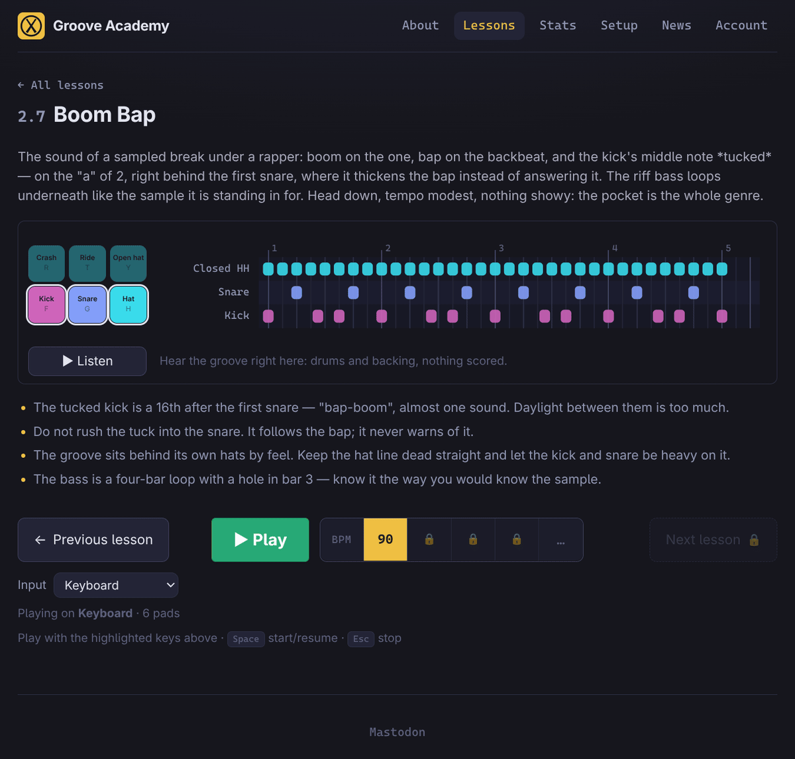
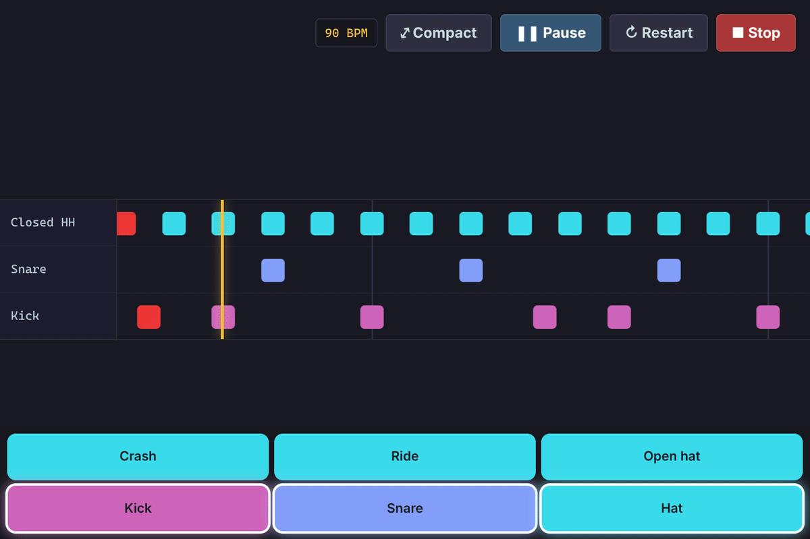
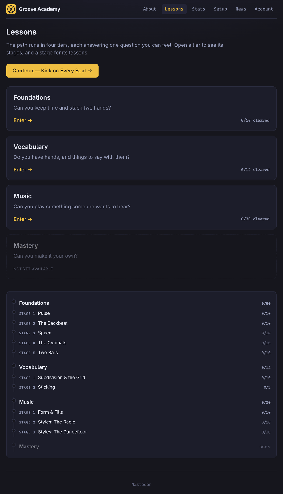
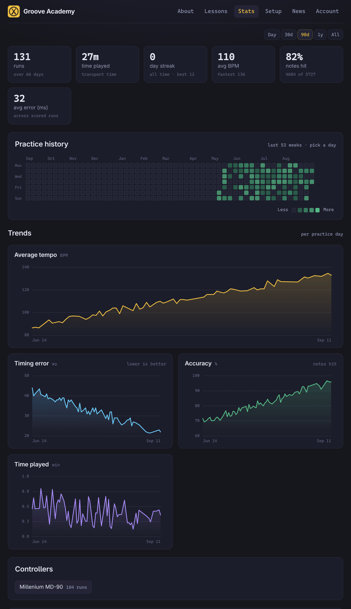

<div align="center">


# Groove Academy

**Free drum lessons that scroll by in your browser.**

[](https://groove.academy) [](https://svelte.dev) [](https://svelte.dev/docs/kit) [](https://www.typescriptlang.org) [](https://vite.dev) [](https://developer.mozilla.org/en-US/docs/Web/API/Web_MIDI_API) [](https://web.dev/explore/progressive-web-apps) [](LESSONS.md)

[**Play now →**](https://groove.academy/lessons) · [Curriculum](docs/curriculum.md) · [Lesson index](LESSONS.md) · [Changelog](CHANGELOG.md) · [Mastodon](https://mastodon.social/@groove_academy)

</div>

---

### In plain words

> Groove Academy is a **drumming teacher that lives in a web page**. Open it, pick a
> lesson, and coloured blocks scroll towards a line — when a block crosses the
> line, you play that drum. It listens to what you actually played, tells you how
> close to the beat you were, and keeps a record so you can see yourself getting
> better week by week.
>
> You can plug in an electronic drum kit or a pad controller, but you don't need
> one: your **computer keyboard** or the **on-screen pads** on a phone work too.
> Nothing to install, no account, no payment — and once you've visited once, it
> keeps working with the Wi-Fi off.

---

## Why it exists

> I built Groove Academy because I couldn't pay for [Melodics](https://melodics.com)
> from Belarus — the payment options simply don't reach here. Learning to drum
> shouldn't depend on having the right card in the right country.
>
> So here's the free version: a growing set of lessons, a note highway that plays
> in time, and your own kit or the on-screen pads. No account, no paywall — just
> sit down and play.
>
> — Anton

---

## See it

<table>
<tr>
<td width="50%" valign="top">



**A lesson at rest.** Every lesson opens the same way — a schematic of the pattern rendered from the lesson's own MIDI, **Listen** to hear it, hints to read, and the tempo you'll play it at.

</td>
<td width="50%" valign="top">



**A run.** Fullscreen highway, a lane per drum, and only your own hits make a sound. Play it clean and it raises your tempo ceiling and unlocks the next lesson.

</td>
</tr>
<tr>
<td valign="top">



**The catalogue.** Four tiers, each answering one question a drummer can feel, opening into stages and then lessons.

</td>
<td valign="top">



**Your practice history.** A 53-week heatmap answers _am I showing up_; four trends answer _am I improving_. <sub>(screenshot uses demo data)</sub>

</td>
</tr>
</table>

---

## What's inside

|                                        | What that means                                                                                                                                              |
| -------------------------------------- | ------------------------------------------------------------------------------------------------------------------------------------------------------------ |
| 🥁 **92 lessons, 10 stages, 4 tiers**  | Written as a curriculum, not a pile of patterns — `plain → core → stretch`, then a checkpoint that interleaves the whole stage.                              |
| 🎛 **Bring your own instrument**       | Web MIDI drum kits and pad grids, a computer keyboard, or on-screen pads. Which one you own is a property of _your controller_, never a fork in the lessons. |
| 🎚 **Scored on timing, not vibes**     | Every note is perfect / good / off / missed, with the millisecond error, per pad.                                                                            |
| 🎧 **Real samples, no synth beeps**    | 12 pre-rendered GM drum kits and 5 basses (three synths and two real electric basses), level-matched and shipped as `.oga`.                                  |
| 🎸 **A backing bass that fades**       | Backing lines are a scaffold: a module opens on a bass that doubles the pulse and a stage ends on one that pushes against you.                               |
| 📈 **Practice stats**                  | Every scored run lands in IndexedDB — tempo, accuracy, timing error, time played, per-pad breakdown — and `/stats` aggregates it per day.                    |
| 📴 **Installable and offline**         | A PWA with a service worker that keeps your kit's samples on disk; the lessons you've opened keep working with no network.                                   |
| ☁️ **Optional cloud sync**             | Sign in and your progress and stats follow you between devices. Leave Supabase unconfigured and everything still works, device-local.                        |
| ♿ **Reduced motion, CVD-safe colour** | Animation is decoration over state that colour already carries, and the chart hues are validated for colour-vision deficiency and contrast.                  |

---

## The curriculum

Three lessons per module, three modules per stage, and a checkpoint that mixes
them — because practising one pattern until it is smooth retains poorly, and
interleaving competing patterns retains far better.

| Tier            | The question it answers                         | Stages                                                    | Lessons |
| --------------- | ----------------------------------------------- | --------------------------------------------------------- | ------- |
| **Foundations** | Can you keep time and stack two hands?          | Pulse · The Backbeat · Space · The Cymbals · Two Bars     | 50      |
| **Vocabulary**  | Do you have hands, and things to say with them? | Subdivision & the Grid · Sticking _(in progress)_         | 12      |
| **Music**       | Can you play something someone wants to hear?   | Form & Fills · Styles: The Radio · Styles: The Dancefloor | 30      |
| **Mastery**     | Can you make it your own?                       | _coming_                                                  | —       |

Full lesson-by-lesson index: [`LESSONS.md`](LESSONS.md).
Why the order is what it is: [`docs/curriculum.md`](docs/curriculum.md).

---

## Quick start

The dev environment is [**devenv**](https://devenv.sh) + [**direnv**](https://direnv.net).
`devenv.nix` pins everything this project needs — Node, pnpm, Python, fluidsynth,
ffmpeg, sox, the Supabase CLI, `toot` — so there is nothing to install by hand and
no version to match:

```sh
direnv allow      # or, without direnv:  devenv shell
dev               # → http://localhost:5173
```

Entering the shell **installs the pnpm dependencies for you** and prints the
commands it brings with it. `dev` serves with `--host`, so the address it prints
is reachable from a phone on the same Wi-Fi — which is how you try the on-screen
pads and the installable PWA on a real touchscreen.

Then open [`/lessons`](http://localhost:5173/lessons), pick anything, press
**Play**. No MIDI hardware needed: the input selector on every lesson page offers
your computer keyboard and an on-screen pad grid.

Any lesson takes a tempo override, so you can drop straight into the tempo you
want to practise at:

```
http://localhost:5173/lessons/boom-bap?bpm=137
```

Precedence is `?bpm=` → the tempo you last practised this lesson at → the tempo
the lesson was written for.

<details>
<summary><b>No Nix? The plain-node path</b></summary>

```sh
pnpm install
pnpm dev
```

Everything in the app itself works. You supply the rest of the toolchain
yourself — Python 3 for the lesson driver, plus fluidsynth and ffmpeg if you
intend to re-render the samples.

</details>

<details>
<summary><b>Optional: cloud sync with Supabase</b></summary>

Copy `.env.example` to `.env` and fill in a Supabase project's URL and anon key.
Migrations live in [`supabase/migrations/`](supabase/migrations); setup notes in
[`supabase/SETUP.md`](supabase/SETUP.md). With no Supabase configured the app
runs exactly as before — progress, stats and quote ratings simply stay on the
device.

</details>

---

## Commands

In the devenv shell, these are on your `PATH`:

| Shell command    | Runs                       | What it does                                                                                         |
| ---------------- | -------------------------- | ---------------------------------------------------------------------------------------------------- |
| `dev`            | `pnpm dev --host`          | Dev server, on the LAN too, with Node's heap raised to 8 GB so a long session doesn't abort mid-work |
| `build`          | `pnpm build`               | Production build                                                                                     |
| `check`          | `pnpm check`               | `svelte-check` + the kit-schematic consistency check                                                 |
| `audit-samples`  | `render-drums.py --audit`  | List drum samples that render as silence                                                             |
| `repair-samples` | `render-drums.py --repair` | Substitute them in place — needs ffmpeg, not the 244 MB SoundFont                                    |
| `vercel …`       | `npx vercel@latest …`      | Vercel CLI                                                                                           |
| `toot post …`    | —                          | Announce a release on Mastodon (`toot login` once)                                                   |

`pnpm preview` serves the production build — the only way to exercise the
service worker properly, since its precache manifest is empty in dev.

Rebuilding the generated assets (all committed, so you only run these after
changing a source):

| Command                           | What it rebuilds                                                              |
| --------------------------------- | ----------------------------------------------------------------------------- |
| `python3 scripts/make-lessons.py` | Every lesson MIDI and `static/lessons/manifest.json`                          |
| `python3 scripts/render-drums.py` | The 12 drum kits, to `.oga` (needs the SoundFont)                             |
| `python3 scripts/render-bass.py`  | The bass notes, to `.oga`                                                     |
| `python3 scripts/make-quotes.py`  | The quote-of-the-day JSON, from the editorial CSV                             |
| `python3 scripts/check-kits.py`   | Nothing — it fails loudly when a kit's pads and its SVG schematic drift apart |

Commits run `eslint` and `prettier` through devenv's git hooks.

---

## How it's laid out

```
src/
  lib/
    controller.svelte.ts     the student's instrument — the facade over
                             pads, hi-hat wiring, pedals and transport;
                             one call, handle(), interprets raw MIDI
    controller-preview.svelte the only thing that draws pads (capture / map / play)
    lesson-chart.svelte      the schematic, rendered from the lesson's own MIDI
    midi.ts  drums.ts        parsing, scheduling, sample playback
    stats.ts  trend-chart.svelte   practice log and the charts over it
    presets.ts               kit profiles: geometry and drum roles, never notes
  routes/
    lessons/                 catalogue, tiers, stages, and /lessons/[id]
    stats/  onboarding/  news/  account/  debug/
scripts/
  lessons/                   the curriculum itself — one Python module per stage
  make-lessons.py            the driver that writes MIDIs + the manifest
  render-drums.py  render-bass.py   the sample pipeline
static/
  lessons/  drums/  bass/  kits/   generated assets, committed
```

**Read [`AGENTS.md`](AGENTS.md) before changing anything structural.** It is the
architecture document — why the Controller is a facade, why the hi-hat is
discovered rather than asked about, why level trims are baked into the samples,
what the release process is.

---

## Adding a lesson

The curriculum is code. A stage is one Python module exporting a `STAGE`, and a
lesson is a slug, a tempo, a pattern and its prose, side by side:

```python
lesson(
    slug="boom-bap",
    name="Boom Bap",
    tier="core",
    bpm=90,
    bars=4,
    drums=...,          # pattern helpers from grids.py
    bass=...,           # a backing line from bass.py
    summary="...",      # the catalogue card
    description="...",  # the lesson page
    hints=[...],        # what to actually pay attention to
)
```

Then `python3 scripts/make-lessons.py` rewrites the MIDI tree and the manifest.
A lesson's **id is its slug and never changes** — the `2.7` you see is rendered
from position, so inserting a lesson renumbers the catalogue without orphaning
anyone's practice history. The how-to is [`docs/LESSONS.md`](docs/LESSONS.md).

---

## Documentation

| File                                       | What it holds                                        |
| ------------------------------------------ | ---------------------------------------------------- |
| [`AGENTS.md`](AGENTS.md)                   | Architecture and conventions — the one to read first |
| [`docs/curriculum.md`](docs/curriculum.md) | The pedagogy: why the stages are in this order       |
| [`docs/LESSONS.md`](docs/LESSONS.md)       | How to write a lesson or a stage                     |
| [`LESSONS.md`](LESSONS.md)                 | Every lesson, in order                               |
| [`CHANGELOG.md`](CHANGELOG.md)             | Complete release history                             |
| [`THANKS.md`](THANKS.md)                   | Sample sources, authors and licences                 |
| [`TODO.md`](TODO.md)                       | What's next                                          |

---

## Credits

The bass samples come from the [FreePats project](https://freepats.zenvoid.org/)
and are CC0 public domain; the drums come from a community GM percussion bank.
Every source, what was taken from it and under what licence is credited in
[`THANKS.md`](THANKS.md) — **any SoundFont whose samples ship here must be listed
there**.

Built by [Anton Vasiljev](https://github.com/antono). Say hello on
[Mastodon](https://mastodon.social/@groove_academy).

<div align="center"><br>

**[groove.academy](https://groove.academy)** — sit down and play.

</div>
